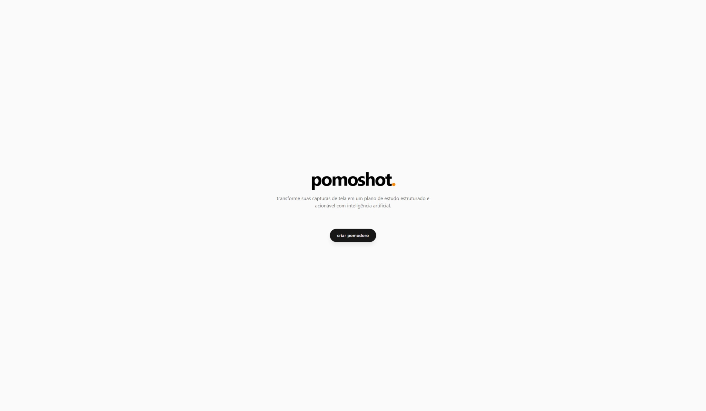

# 📘 **pomoshot.**

Transforme suas capturas de tela em um plano de estudo Pomodoro estruturado com IA.

<div align="center">
  
</div>

---

## 🚀 Sobre o projeto

**pomoshot.** é uma aplicação que utiliza IA para analisar screenshots de aulas, identificar tópicos, estimar o tempo total necessário e gerar automaticamente um plano Pomodoro estruturado.

Fluxo principal:

1. Faça upload das capturas
2. A IA processa e extrai as lições
3. Ajuste tempos de foco e pausa
4. Receba seu cronograma Pomodoro completo

---

## 🧩 Estrutura do projeto

O projeto utiliza **Bun Workspaces**, dividido em dois pacotes:

```
/frontend   → Aplicação React (UI)
/backend    → API Elysia (processamento das aulas)
```

---

## 🛠️ Tecnologias

### **Frontend**

-  React
-  TypeScript
-  Tailwind CSS

### **Backend**

-  Bun
-  Elysia
-  Eden Treaty
-  Google GenAI

---

## ▶️ Como rodar

Clone o repositório:

```sh
git clone https://github.com/seuusuario/pomoshot.git
cd pomoshot
```

Instale as dependências:

```sh
bun install
```

Rodar o monorepo:

```sh
bun dev
```

Rodar o backend:

```sh
bun dev --filter '@pomoshot/backend'
```

Rodar o frontend:

```sh
bun dev --filter '@pomoshot/frontend'
```

---

## 🧭 Roadmap

Funcionalidades planejadas:

-  [ ] Salvar progresso e retomar sessões
-  [ ] Notificações sonoras ao final de cada bloco
-  [ ] Modo escuro
-  [ ] Modo totalmente offline
-  [ ] Histórico de estudos
-  [ ] Compartilhamento do plano

---

## 📌 Status

Projeto em desenvolvimento. Nenhuma licença aplicada no momento.
